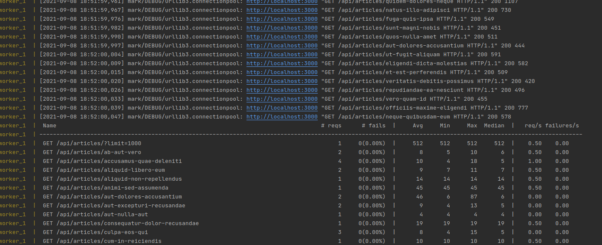
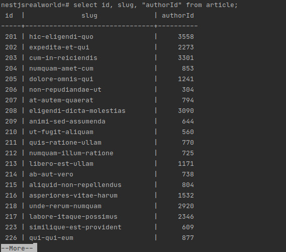
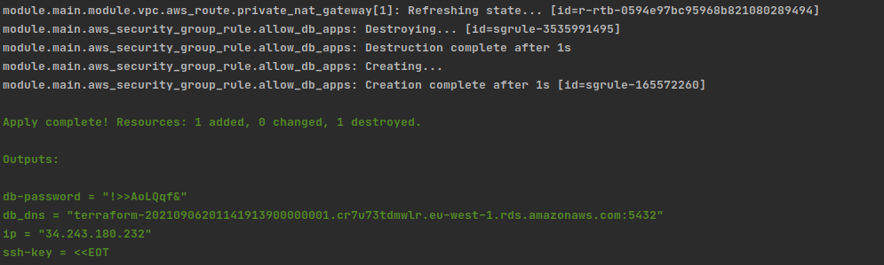

## Load test

Load test script has been written on top of locust framework. It can be found in .load-test directory.
Locust brings dashboard and statistics out of the box and allows to start in simple way by providing high level library, at the
same time since tests are code based it gives lot of flexibility when it comes to writing
different scenarios. Code made in this task simulates opening articles by user,
it waits between 0.5 to 1s and send request (with randomly chosen slug) to api endpoint. Concurrency can be
easily increased by changing input parameters in docker-compose.yml file. Below sample run output:

``cd .load-test && docker-compos up ``



## Data Seed
directory **src/fixtures** and file **src/data.ts** contains implementation of feeding postgres database with
random data using fakerjs library.  Running in root directory:
```
docker-compose up -d # start postgres locally
yarn loadtata
```




## Development Dockerfile
Dockerfile in root project directory represents application for local development purposes
In contrast to production dockerfile where final image contains only minimal for run compiled files and non dev
npm dependencies the development version of Docker file contains entire project
in order to ensure better debugging experience, for the same reason it uses yarn start:watch as start command

## Terraform
The .infra directory represents aws iac written in terrafrom
Main module represents infrastructure components as a whole, by providing appropriate input variables 
it can be used for creating different stages of infrastructure - for instance in this task scenario we have staging 
module. What it does: 
- creates vpc with public and private subnets
- launch ec2 instance in public subnet with sg allowing https traffic
- launch postgresql instance in private network with security group only allowing traffic from ec2 sg source

``cd .infra/staging && terraform apply``




## Deployment

For simplicity only 2 step based github action was created in .github/workflows/deployment.yml
It executes test and ssh based deployment to ec2 instance provisioned in terrafrom

## URL
https://github.com/markownikow/nestjs-realworld-example-app


Why aws
Apart from that aws is mature cloud provider with very extensive documentation it aws chose here 
dut to fact I am most familiar with it among other popular providers